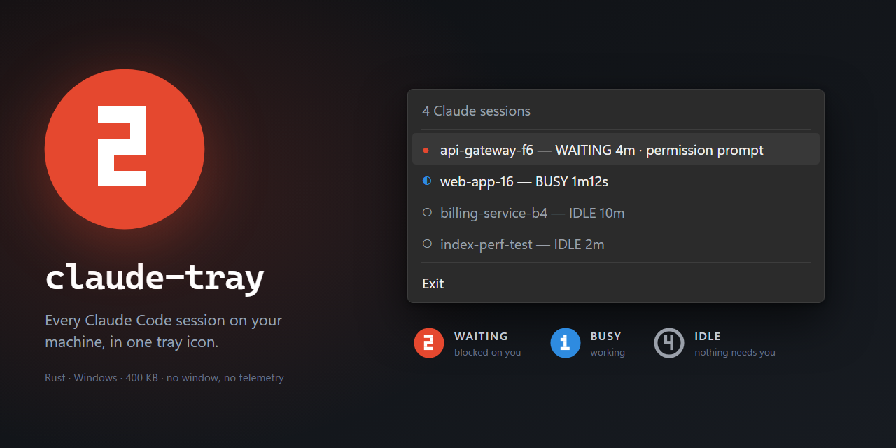
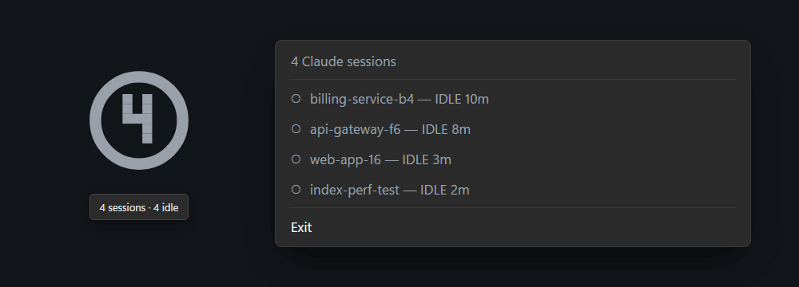

# claude-tray



Tray-resident status for every running Claude Code session on this machine. Tells you at a glance
— without focusing the terminal — how many sessions are running and whether any of them is blocked
waiting on you.

Display only. It never writes to Claude Code's files and never sends it anything.

```
tray icon:  ( 2 )   red disc   -> 2 sessions waiting on you
            ( 1 )   blue disc  -> 1 session working, none blocked
            ( 4 )   gray ring  -> 4 sessions, all idle
```

Right-click the icon for the session list, and a row in it to jump to that session. Rows are
sorted attention-first (waiting → busy → idle), then
oldest-first within a status, so the session that has been stuck longest is always at the top — as
below, where a permission prompt pulls `api-gateway-f6` to the top of the list.



## Desktop alerts

A tray icon only helps while you are looking at it. For the times you are not, claude-tray can
raise an Outlook-style alert in the corner of the screen while any session sits in a status you
asked to be told about, and repeat it on a schedule until you deal with it.

```
┌──────────────────────────────────────────────────────────────────┐
│ 2 Claude sessions are waiting on you                             │
│ ● api-gateway-f6 · Rate limiting rollout — WAITING 4m · permission prompt
│ ● claude-tray-97 · Claude-tray repo setup — WAITING 38s · input needed
└──────────────────────────────────────────────────────────────────┘
```

Rows carry the conversation's own title beside the registry name. The registry name is derived
from the folder (`claude-tray-97`), so it says *where* a session is but not what it is about, and
two sessions in the same folder differ only by a suffix. The title is read from Claude Code's
transcript for that session — `%USERPROFILE%\.claude\projects\<encoded cwd>\<sessionId>.jsonl` —
preferring a title you set (`custom-title`) over a generated one (`ai-title`). Transcripts run to
megabytes and grow constantly, so only the last 256KB is searched, and only when the file has
changed since it was last read.

Everything is configured from **Settings…** in the tray menu, which opens a panel that stays put
while you work through it. Changes apply and are written to disk the moment you click them, so
nothing is lost on a reboot. Tick boxes toggle; the `‹ value ›` rows step through their choices —
click the row (or `›`) for the next value, `‹` for the previous. The panel closes when the pointer
leaves it, or on Esc.

Settings deliberately are not menu items: a Win32 menu closes on every click, so changing three
things meant reopening the menu three times.

| Setting | Default | Choices |
| --- | --- | --- |
| Show desktop alerts | on | on / off |
| Alert me about | Waiting on you | any of waiting, busy, shell, idle, unknown |
| Repeat alert | Every minute | only once, 30s, 1m, 2m, 5m, 10m, 15m, 30m |
| Alert sound | Notification | none, system beep, notification, asterisk, exclamation, critical stop, question |
| Alert stays for | 8 seconds | until clicked, 5s, 8s, 15s, 30s |
| Check sessions every | 1 second | 0.5s, 1s, 2s, 5s, 10s, 30s |

Settings live in `%APPDATA%\claude-tray\config.json`, written with defaults on first run so there
is something to hand-edit. Picking a sound plays it, so you can hear what you are choosing, and
**Test alert now** shows a sample alert without waiting for a session to block.

The alert repeats on the interval for as long as a session stays in a watched status. A session
that *newly* enters one interrupts that schedule and alerts immediately, so a fresh permission
prompt never waits out the remainder of a repeat interval. When nothing matches any more, the
schedule re-arms, so the next one alerts at once.

Click a row in the alert to jump to that session — it raises the window hosting it and dismisses
the alert. Rows highlight under the pointer and show a hand cursor, and hovering holds the alert
open so it cannot expire on the way to a click. Clicking anywhere else just dismisses. Session
rows in the tray menu do the same thing. See the limitations below for what "jump to" can and
cannot mean.

The alert never takes focus (`WS_EX_NOACTIVATE`), so it cannot swallow a keystroke meant for the
terminal you are typing in. It is a plain Win32 window rather than a WinRT toast on purpose: a
toast needs a registered AppUserModelID and a Start-menu shortcut, and Focus Assist and the
per-app notification switches can silently suppress it — the wrong behaviour for something whose
whole job is to be seen.

The tray menu follows the system theme too. A Win32 menu is drawn by the shell and always uses the
light scheme unless the process opts in through two uxtheme entry points that exist only as
ordinals — `SetPreferredAppMode` (135) and `FlushMenuThemes` (136), the same pair Chromium and
Electron use. Both are resolved defensively; if either is missing the menu just stays light. The
mode is set before the first menu is built and re-applied when the system theme changes.

Both owner-drawn windows paint in the system colours: `GetSysColor` for the light scheme, the shell's dark
surface colours when apps are set to dark (`GetSysColor` predates dark mode and keeps returning
the light scheme, so there is nothing to read for that), and the Windows accent colour for the
panel's stripe, ticks and values. The theme is re-read each time a window is shown, so switching
it while the app runs is picked up without a restart.

To see either without going through the tray:

```powershell
.\target\release\claude-tray.exe --demo-alert
.\target\release\claude-tray.exe --demo-settings
```

## Where the data comes from

Claude Code maintains a live registry at `%USERPROFILE%\.claude\sessions\<pid>.json` (or
`%CLAUDE_CONFIG_DIR%\sessions`), rewriting a session's file on every status change:

```json
{"pid":10900,"sessionId":"45f2d40d-…","cwd":"C:\\Users\\you\\repos\\api-gateway",
 "name":"api-gateway-f6","kind":"interactive","status":"waiting",
 "waitingFor":"permission prompt","startedAt":1786632182305,"statusUpdatedAt":1786633564687}
```

- `status` is one of `busy`, `shell`, `idle`, `waiting`.
- `waitingFor` (only while `waiting`) is one of `permission prompt`, `input needed`, `dialog open`,
  `sandbox request`, `worker request`.
- `kind` is one of `interactive`, `bg`, `daemon`, `daemon-worker`; daemon kinds are not listed.

The registry is polled once per second by default, adjustable under Settings → Check sessions
every. A session whose JSON is caught mid-write falls back to the last good copy for that tick, so
rows don't flicker.

Claude Code deletes a session's file on a clean exit, but a killed session leaves the file behind,
so each pid is verified to be a running `claude.exe` before it is listed. That check also guards
against pid reuse. If a pid exists but its image path can't be read, the session is still shown —
a stale row beats a missing one.

## Build and run

```powershell
cargo build --release
.\target\release\claude-tray.exe
```

No console window appears; look for the icon in the tray. Exit from the tray menu.

### Start it with Windows

Drop a shortcut to the release exe in the startup folder:

```powershell
$exe = "$PWD\target\release\claude-tray.exe"
$lnk = "$env:APPDATA\Microsoft\Windows\Start Menu\Programs\Startup\claude-tray.lnk"
$s = (New-Object -ComObject WScript.Shell).CreateShortcut($lnk)
$s.TargetPath = $exe
$s.Save()
```

## Limitations

- Some Claude Code builds do not write a `status` field to the session file at all (observed on
  2.1.247, which advertises a `notify_idle` peer feature and appears to publish status over its
  messaging pipe instead). Where that is the case every session reads as `Unknown`, the icon stays
  a gray ring with a live count, and the waiting/busy colours never appear. Alerts still work —
  tick **Unknown / not reported** under Settings → Alert me about.
- Clicking a session row raises the window *hosting* that session, not the session itself. A
  session is a console process with no window of its own, so the row walks up the process tree to
  the first real top-level window — the Claude desktop app, Windows Terminal, a console host.
  Where a host runs several sessions in one window (the desktop app runs them all under a single
  window), every one of those rows raises that same window and lands on whichever tab was last
  open. Selecting the tab would mean driving Claude Code over the private pipe named in
  `messagingSocketPath`, which is undocumented and which this program deliberately does not touch.
  Clicking a desktop-hosted session *does* also fire the deep link that would select the exact
  session — `claude://code/continue?session=local_<sessionId>&source=desktop_action`, where
  `<sessionId>` is the one in the registry file and `local_` is the prefix the app's own session
  store uses. The app accepts the URL (a malformed id logs `code entry link invalid ?session`
  instead) but currently answers `claudeURLHandler: code entry deep link gated off`: the handler
  sits behind a server-side GrowthBook flag. Until that flag is enabled the link costs one no-op
  launch and the window raise is what you see; once it is enabled, clicks land on the right session
  with no change here. It is only sent for sessions whose `entrypoint` is `claude-desktop`, since
  firing `claude://` for a terminal-hosted session would raise the wrong application.
- The menu is a snapshot from the moment it opened — Windows can't repaint an open menu, so elapsed
  times freeze until you close and reopen it.
- Menu rows use the system menu font, which is proportional, so columns are separated with `—` and
  `·` rather than aligned with padding.
- Windows caps tray tooltips at 128 characters; the hover text is a summary, not the full list.
